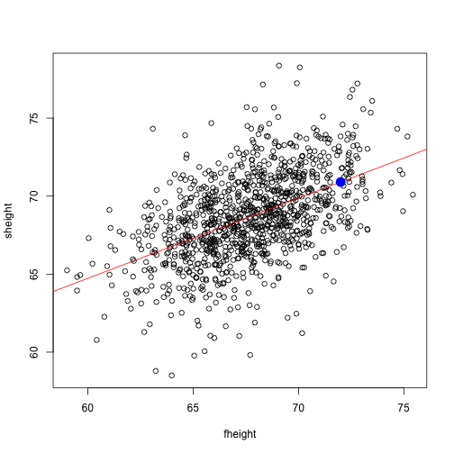

ShinyAppProject
========================================================
author: William Lewis
date: 22 October 2018
autosize: true

Regression
========================================================

Linear Regression is a statistical modeling technique to establish the relationship among variables developed by Francis Galton in the 1800's.  It described the phenomenon of children's heights regressing towards a normal average.  

The following uses the father.son data set from the UsingR package to predict son's height from a father's height.

source: https://en.wikipedia.org/wiki/Regression_analysis

The Model
========================================================


```r
library(UsingR)
data("father.son")
mod1 <- lm(sheight ~ fheight, data = father.son)
```

Best Fit line 
========================================================



Conclusion 
========================================================


